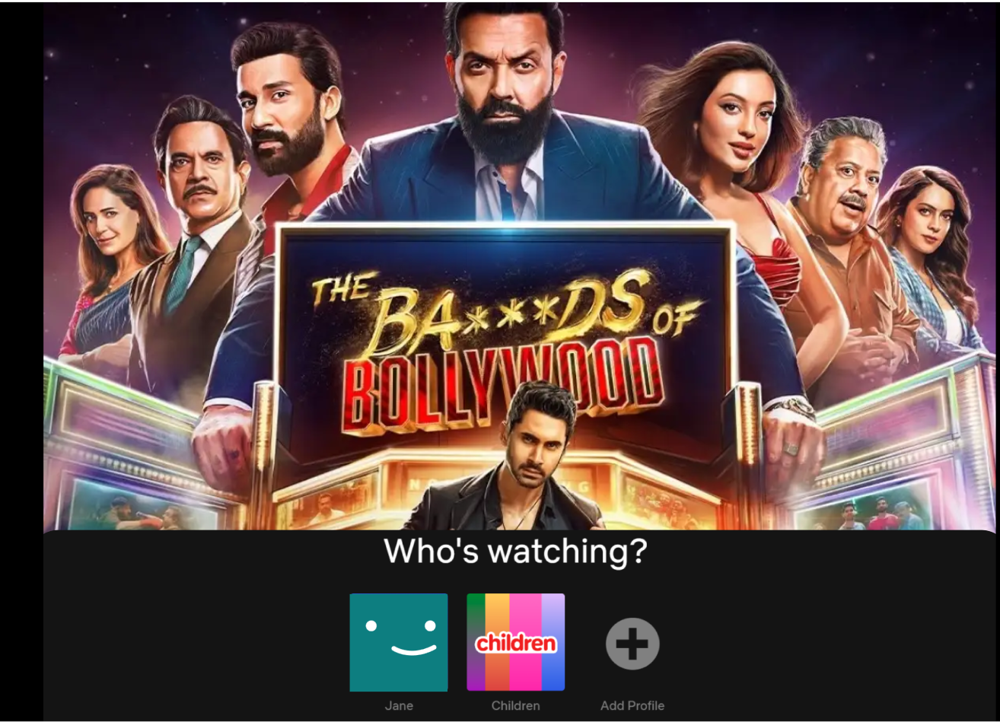
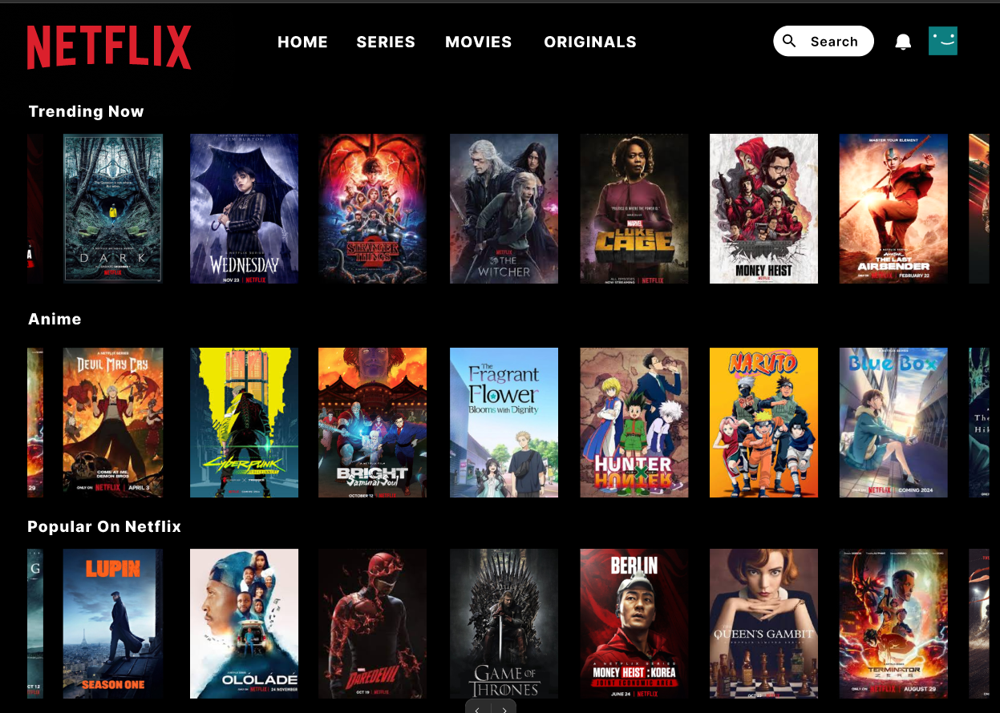
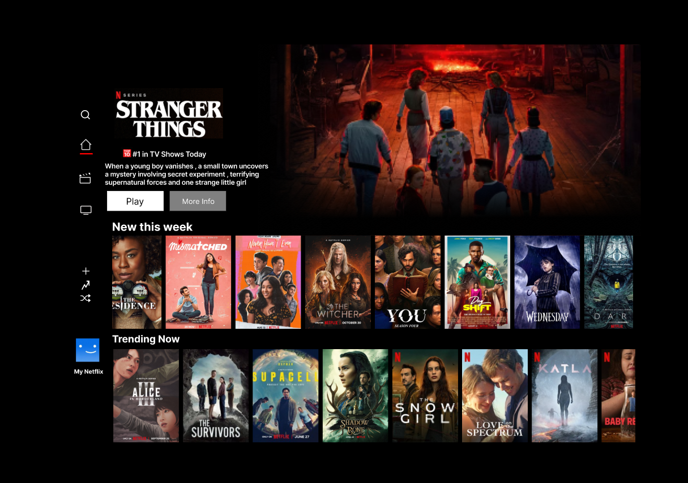
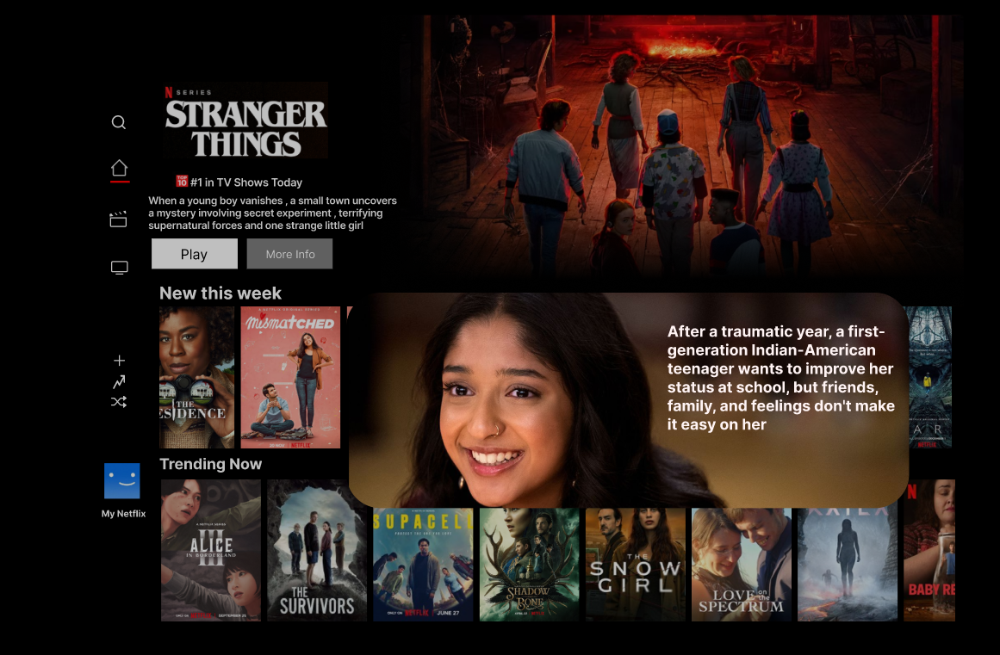

# NetFlix

🎬 Netflix UI Clone — Figma Prototype

Experience a sleek Netflix-inspired UI design prototype built entirely in Figma. This project showcases key screens like home feed, movie details, search, and interactions — perfect for inspiration or future development.

🔗 Live Prototype
👉 https://www.figma.com/proto/B7ejmGxWpkBTQQEcTL8rbu/netflix?node-id=39-11&starting-point-node-id=39%3A10&t=n2ptpbnMRwUfcVnx-1

📌 Description

This project is a UI/UX design prototype that replicates the Netflix experience, including:

✔ Home browsing interface
✔ Movie/show detail screens
✔ Search and category navigation 
✔ Beautiful, modern visual layout designed for mobile

👉 Designed entirely in Figma with interactive prototyping features.

📱 Screenshots

Include your exported screens here once added to your repo:

Make sure the file paths match the actual folder and filenames in your repository.

🛠 Tech Stack

Figma — UI/UX Design & Interactive Prototyping

(Optional future tech if building this into a real app)
React | React Native | Flutter | HTML/CSS

🚀 How to Use

Click the Figma prototype link above

Explore the interactive Netflix UI screens

Use the design for inspiration or development

🧑‍💻 Author

Devika Krishnan

🌟 Feel free to personalize this ✨
